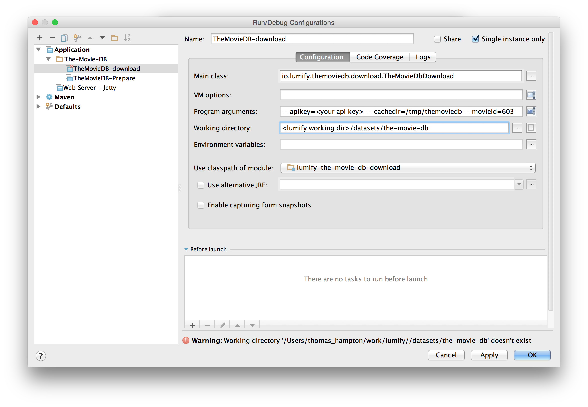
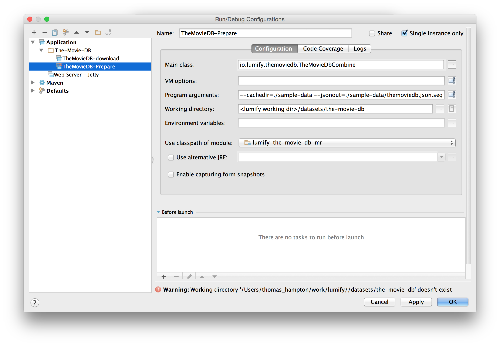

# TheMovieDb.org Dataset

[TheMovieDb.org](http://www.themoviedb.org/) is an online user contributed movie database. With an API key you can use the 
REST API which this module takes advantage of to download the movie catalog for ingest into Lumify.

## Build The-Movie-DB project
If you haven't already built The-Movie-DB project, follow these steps to build the download, prepare, and import
programs.

        cd <working dir>/datasets/the-movie-db

        mvn clean package -P web-war -am

## Downloading Data

TheMovieDb.org does not allow downloading their complete dataset all at once so a starting point must be chosen. In the following
movie 603 (The Matrix) is used. Also because of data rate limiting this may take a very long time.

* Run `io.lumify.themoviedb.download.TheMovieDbDownload --apikey=<your api key> --cachedir=/tmp/themoviedb --movieid=603`

### Configure IntelliJ IDEA to run the download program
To run The-Movie-DB download from IntelliJ IDEA configure a Application Run/Debug configuration as illustrated below.

        Main class:                 io.lumify.themoviedb.download.TheMovieDbDownload
        Program arguments:          --apikey=<your api key> --cachedir=/tmp/themoviedb --movieid=603
        Working directory:          <lumify working dir>/datasets/the-movie-db
        Use classpath of module:    lumify-the-movie-db-download

**Be sure to replace <your api key> and <lumify working dir> with appropriate values relative to your personal development environment.*

## Prepare the Data

To get the data in a format usable by the MR jobs we need to create sequence files.

* Run `io.lumify.themoviedb.TheMovieDbCombine --cachedir=/tmp/themoviedb --jsonout=/tmp/themoviedb.json.seq --imgout=/tmp/themoviedb.img.seq`

### Configure IntelliJ IDEA to run the prepare program
To run The-Movie-DB prepare program from IntelliJ IDEA configure an Application Run/Debug configuration as illustrated below.

        Main class:                 io.lumify.themoviedb.TheMovieDbCombine
        Program arguments:          --cachedir=./sample-data --jsonout=./sample-data/themoviedb.json.seq --imgout=./sample-data/themoviedb.img.seq
        Working directory:          <lumify working dir>/datasets/the-movie-db
        Use classpath of module:    lumify-the-movie-db-mr

**Be sure to replace <lumify working dir> with an appropriate value relative to your personal development environment.*

##Import Data Using MR

### Import TheMovieDb ontology `datasets/the-movie-db/ontology`

Before importing the sample data you must import the-movie-db ontology into Lumify.  This proceedure will import the ontology
via the Lumify user interface.

* zip the content of the datasets/the-movie-db/ontology directory into a file called the-movie-db-ontology.zip
* From the Lumify web app select **"Admin -> ONTOLOGY -> Upload"** to launch the Ontology Upload pane
* Click the **"Select File..."** button.  A file chooser should be launched.  Select **the-movie-db-ontology.zip** file you created earlier and open it.
* Click the **"Upload"** button. The ontology should successfully upload.

### Copy the two sequence files generated in the last section to hdfs

From the Lumify Docker shell copy the two sequence files into HDFS where the MapReduce jobs, in the next step, can find them.

        cd /opt/lumify-source/datasets/the-movie-db/sample-data

        hadoop fs -mkdir /user/root

        hadoop fs -put themoviedb.json.seq /user/root/

        hadoop fs -put themoviedb.img.seq /user/root/

### Ingest the movie data

From the Lumify Docker shell run the following MapReduce jobs to ingest the movie data. Import requires two stages.
Importing movies, people, etc. and importing images.

        cd /opt/lumify-source/datasets/the-movie-db/the-movie-db-mr/target

        hadoop jar lumify-the-movie-db-mr-with-dependencies.jar io.lumify.themoviedb.ImportJsonMR themoviedb.json.seq

        hadoop jar lumify-the-movie-db-mr-with-dependencies.jar io.lumify.themoviedb.ImportImgMR themoviedb.img.seq
