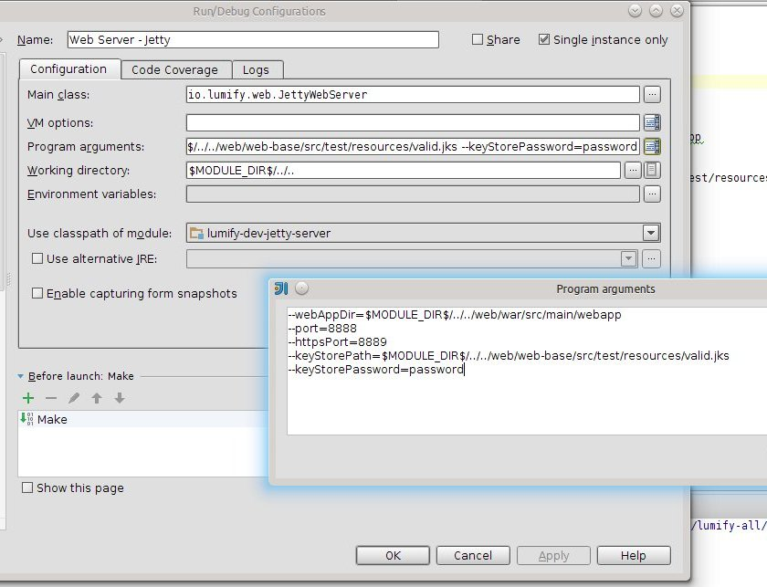

# Prereqs

* Setup [configuration](configuration.md) on your host machine.
* Install [dependencies](dependencies.md) on your host machine.

# IntelliJ

## Development Jetty Web Server

* Module: `lumify-dev-jetty-server`
* Main class: `io.lumify.web.JettyWebServer`
* Program arguments:

        --webAppDir=$MODULE_DIR$/../../web/war/src/main/webapp
        --port=8888
        --httpsPort=8889
        --keyStorePath=$MODULE_DIR$/../../web/web-base/src/test/resources/valid.jks
        --keyStorePassword=password

* Working directory: `$MODULE_DIR$/../..`

