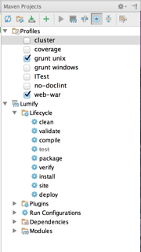
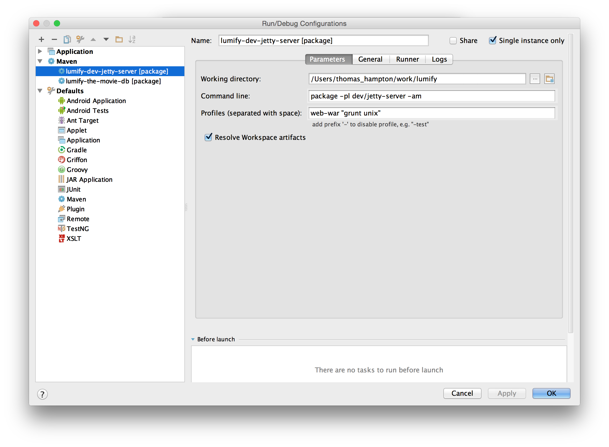
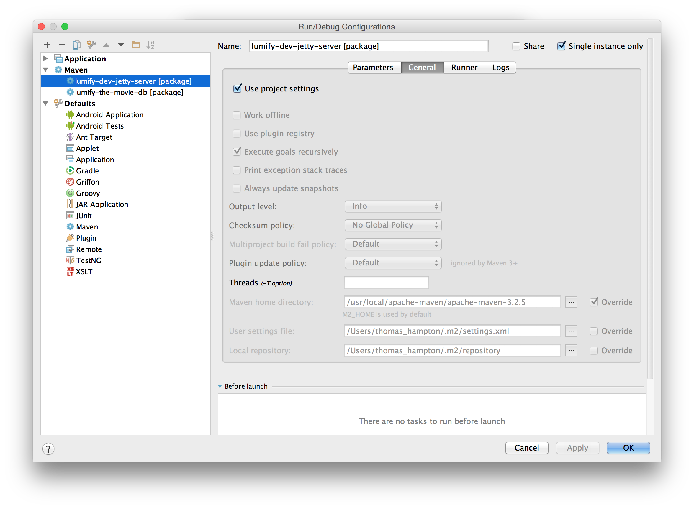
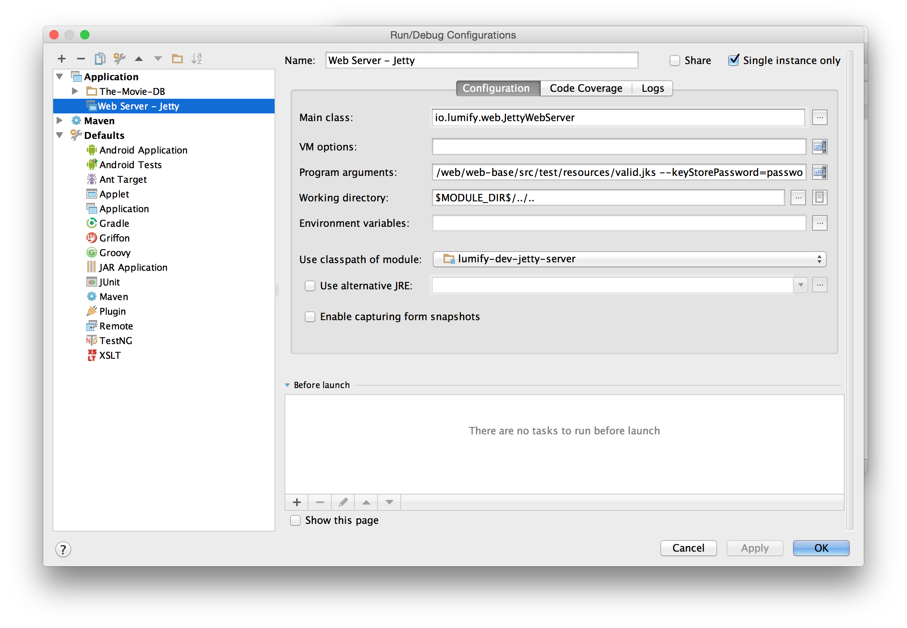

# Prereqs

* Setup [configuration](configuration.md) on your host machine.
* Install [dependencies](dependencies.md) on your host machine.

# IntelliJ

## Development Jetty Web Server
The Lumify project includes a Maven script that performs all the build steps required to build the Lumify Web App for
the Jetty Server. When using IntelliJ IDEA to build Lumify it is important to use the Maven integration to build Lumify
and not the **Make Project** function in IntelliJ.  The following instructions illustrate configuring IntelliJ IDEA
run/debug configurations for building & running the Lumify Jetty Server.

### Open the Lumify project in Maven
* Open IntelliJ IDEA ide, the **Welcome to IntelliJ IDEA** dialog should be displayed.  If the welcome dialog is not displayed then select **File -> Open** from the menubar.
* Click the **Open** button, a file chooser should be displayed.
* Select the folder where the Lumify source code is located, the project will be opened in IntelliJ IDEA

### Configure IntelliJ IDEA Java JDK
* Open **File -> Project Structure** from the menu bar.  The **Project Structure** dialog should be displayed
* Select the **Project** option on the left to display the project SDK settings.
* In the **Project SDK** combobox select **Java 1.7**.
* Click the **Apply** button and close the dialog.

### Configure IntelliJ IDEA Path Variables
* Select **IntelliJ IDEA -> Preferences** from the menu bar.  The Preferences dialog should disply.
* Select **Build, Execution, Deployment -> Path Variables** form the options on the left.
* Add the **JAVA_HOME** path variable setting the value to the location of the Java 1.7 JDK home directory 

### Maven Projects Plugin pane
* Open the Maven Projects pane by selecting the **View -> Tool Windows -> Maven Projects** menu item
* In the Maven Projects pane select the cog icon, in the upper right corner, and select **Group Modules**
* Ensure that the **web-war** and **grunt unix** Maven Profiles are selected
* Ensure that the **Toggle 'Skip Tests' Mode** tool bar button is selected to disable executing unit tests (unless you want to run unit tests)




### Configure IntelliJ IDEA to build Lumify Jetty Web Server
* Create a Maven Run/Debug Configuration in IntelliJ IDEA with the following parameters
	* Working directory - should be set to the location of your Lumify working directory
	* Command line
		```
		package -pl dev/jetty-server -am
		```
		
		```
		package - the maven goal to build
		-pl     - identifies the maven project for the Lumify Jetty Server that should be built
		-am     - causes all dependencies to be built as well.
		```
		
	* Profiles - List the Maven Profiles that should be used for the build.



* Configure the General tab as follows



### Configure IntelliJ IDEA to run Lumify Jetty Web Server
* Create a Application Run/Debug Configuration in IntelliJ IDEA with the following configuration.
	* Module: `lumify-dev-jetty-server`
	* Main class: `io.lumify.web.JettyWebServer`
	* Program arguments:
		
		```	
		--webAppDir=$MODULE_DIR$/../../web/war/src/main/webapp
		--port=8888
		--httpsPort=8889
		--keyStorePath=$MODULE_DIR$/../../web/web-base/src/test/resources/valid.jks
		--keyStorePassword=password
		```

	* Working directory: `$MODULE_DIR$/../..`
	* Use classpath of module: lumify-dev-jetty-server


