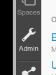
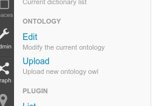
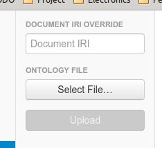

# Ontology

Lumify uses OWL files to define what type of entities you can create, what properties they can have and what they
can connect to. Lumify has extended the OWL file to include additional attributes that will change how Lumify
works.

For an example see the [dev ontology](../examples/ontology-dev/).

## Loading an ontology

To load an ontology you will need a zip file containing the OWL file and all of it's dependencies. For the dev
ontology you would zip all the files in the ontology-dev directory and call it dev.owl. Then you will need to upload
the ontology into Lumify.

* Click the "Admin" tool button.

  

* Click the "Upload Ontology" button.

  

* Click the "Select File..." button and select you zip file. Assuming your OWL file has `owl:Ontology/rdf:about`
  then the document IRI is not required.

  

* Click "Upload"

## Lumify OWL Extensions

### DatatypeProperty

* **intent** - See the [Intents](#intent) section
* **textIndexHints** - Specifies how text is indexed in the full text search. By default text will not be indexed.
  The following options can be included (comma separated):
  * NONE - Do not index this property (default).
  * ALL - Combination of FULL_TEXT and EXACT_MATCH.
  * FULL_TEXT - Allow full text searching. Good for large text.
  * EXACT_MATCH - Allow exact matching. Good for multi-word known values.
* **searchable** - Should this property show up in the UI for searching.
* **displayType** - Specifies how the UI should display the value.
  * dateOnly
  * link
  * textarea
* **propertyGroup** - Allows multiple properties to be included under a unified header in the UI.
* **possibleValues** - Creates a pick list on the UI. The value is a JSON document describing the possible values.

        {
          "M": "Male",
          "F": "Female"
        }

### Class

* **intent** - See the [Intents](#intent) section
* **glyphIconFileName** - The image to use on the UI to display the entity.
* **color** - The color to use when underling the entity in a document.
* **displayType** - Specifies how the UI should display the entity.
  * audio
  * image
  * video
  * document
* **titleFormula** - A javascript function used to display the title of the entity.
* **subtitleFormula** - A javascript function used to display additional information in the search results.
* **timeFormula** - A javascript function used to display additional information in the search results.
* **addRelatedConceptWhiteList** - Limits what items can be added via the "Add Related" dialog.

<a name="intent"/>
## Intents

The ontology defines concepts, relationships, and properties. During data processing Lumify needs to know
 what type of concept, relationship, and property to assign when it finds them. For example if Lumify is scanning a
 document and finds a phone number, Lumify will need to assign a concept to that phone number. This is where
 intents come in.

Intents can be defined in the ontology and overridden in the configuration. To assign an intent you add the
 intent attribute to an OWL element.

    <owl:Class rdf:about="http://lumify.io/dev#phoneNumber">
      <rdfs:label xml:lang="en">Phone Number</rdfs:label>
      <lumify:intent>phoneNumber</lumify:intent>
      ...
    </owl:Class>

To override an intent you can add the following to your configuration.

    ontology.intent.concept.phoneNumber=http://lumify.io/dev#phoneNumber
    ontology.intent.relationship.hasMedia=http://lumify.io/dev#hasMedia
    ontology.intent.property.pageCount=http://lumify.io/dev#pageCount

### Concepts

| Name         | Description                               |
|--------------|-------------------------------------------|
| audio        | Audio file                                |
| city         | Geographic city                           |
| country      | Geographic country                        |
| csv          | Comma separated file                      |
| document     | Document                                  |
| email        | E-Mail address                            |
| entityImage  | Image assigned to an entity               |
| image        | Image file                                |
| location     | Geographic location                       |
| organization | Organization                              |
| person       | Person                                    |
| phoneNumber  | Phone number                              |
| rdf          | Resource description framework (RDF) file |
| state        | Geographic state                          |
| video        | Video file                                |
| zipCode      | Zip code                                  |

### Relationships

| Name                          | Description                          |
|-------------------------------|--------------------------------------|
| artifactContainsImageOfEntity | Artifact has image of entity         |
| artifactHasEntity             | Artifact has entity                  |
| entityHasImage                | Entity has image                     |
| hasMedia                      | Thing has media                      |

### Properties

| Name                    | Type        | Description                                 |
|-------------------------|-------------|---------------------------------------------|
| geoLocation             | geoLocation | Geo-location                                |
| media.clockwiseRotation | integer     | Image clockwise rotation                    |
| media.dateTaken         | date        | Date/time image was taken                   |
| media.deviceMake        | string      | The device make                             |
| media.deviceModel       | string      | The device model                            |
| media.duration          | double      | The length in seconds of the media file     |
| media.fileSize          | long        | The filesize of the media file              |
| media.height            | integer     | The height in pixels of the media           |
| media.imageHeading      | double      | The compass direction the camera was facing |
| media.metadata          | json        | Additional metadata found in the media      |
| media.width             | integer     | The width in pixels of the media            |
| media.yAxisFlipped      | boolean     | Is image Y-axis flipped                     |
| pageCount               | long        | Number of pages in the artifact             |
