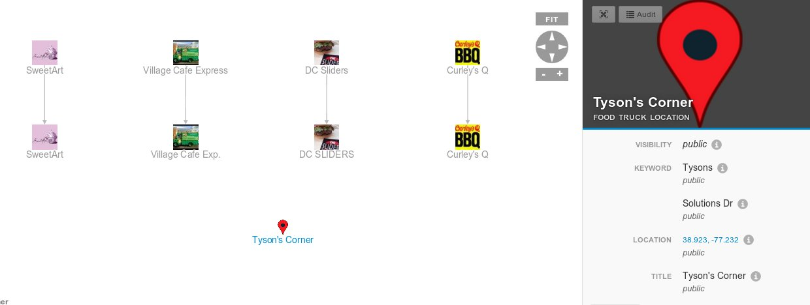

Getting Started
===============

1. [Load](https://github.com/lumifyio/lumify/blob/master/docs/setup-centos-6.5.md#upload-the-dev-ontology) the Twitter ontology [datasets/twitter/ontology](https://github.com/lumifyio/lumify/tree/master/datasets/twitter/ontology)
1. [Load](https://github.com/lumifyio/lumify/blob/master/docs/setup-centos-6.5.md#upload-the-dev-ontology) the Food Truck ontology [examples/food-truck/ontology](https://github.com/lumifyio/lumify/tree/master/examples/food-truck/ontology) 
1. [Configure and run Twitter](https://github.com/lumifyio/lumify/tree/master/datasets/twitter)
1. Setup a new Twitter account or use your existing account and follow some food trucks
   - [ChefonWheels11](https://twitter.com/ChefonWheels11)
   - [VillageCafeINC](https://twitter.com/VillageCafeINC)
   - [GuaposFoodTruck](https://twitter.com/GuaposFoodTruck)
   - [DCSLIDERSTRUCK](https://twitter.com/DCSLIDERSTRUCK)
1. Run the Twitter Ingest to ingest some Tweets.
1. If you search for a particular food truck twitter account you should be able to add them to your graph.
1. For each food truck Twitter account you will need to associate it with a "Food Truck" entity.
   This can be accomplished by finding some text with the food truck name and resolving it as a new
   "Food Truck".
1. Connect the "Food Truck" entities to the food truck twitter accounts with a "Has Twitter Account" connection.
1. Create "Food Truck Location" entities for locations where the food trucks might be.
1. Add a "Location" properties to the "Food Truck Location" entities.
1. Add "Keyword" properties to the "Food Truck Location" entities.
1. As new Tweets come in the Truck locations will be updated based on keywords found in the tweets and you
   will see their location on the map.

How it Works
============

Graph Property Workers
----------------------

- FoodTruckHasTwitterAccountOnCreateGraphPropertyWorker - Assigns an image to a "Food Truck" entity when
  the "Has Twitter Account" edge is created.
- FoodTruckLocationUpdateGraphPropertyWorker - Assigns a location to a "Food Truck" entity when a keyword
  is detected for the current day.
- FoodTruckRemoveOldGeoLocationsGraphPropertyWorker - Removes old location properties when the "Food Truck"
  entity gets updated.
- FoodTruckTweetAnalyzerGraphPropertyWorker - Detects and creates "Has Keyword" edges between Tweets and
  "Food Truck Location".
